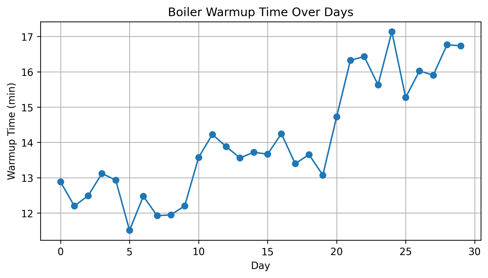

# Boiler Thermal Simulation Project

This project simulates boiler warm-up behavior and performance degradation using Python.

It analyzes how warm-up time changes over days and visualizes system behavior using synthetic data.

## Tools
- Python
- NumPy
- Pandas
- Matplotlib
## Result

